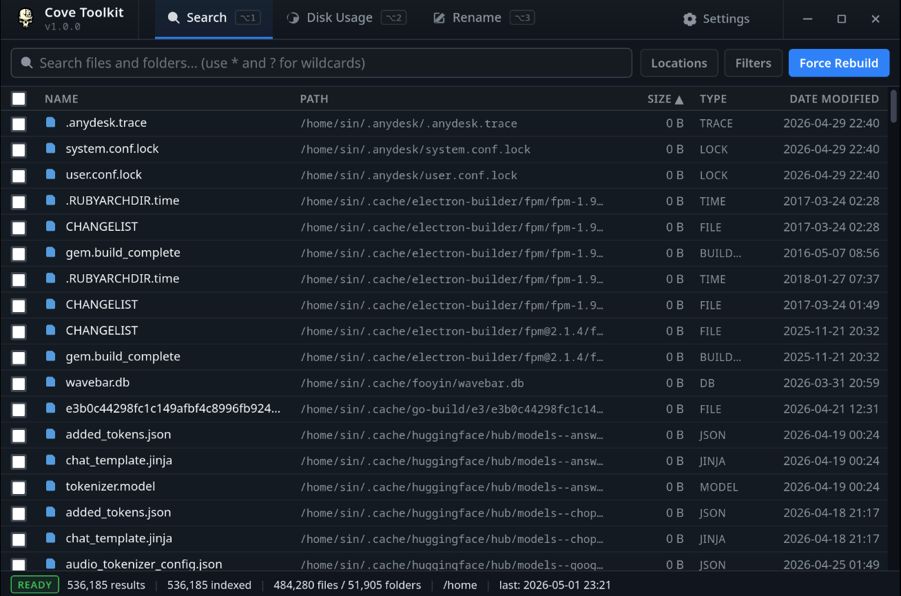
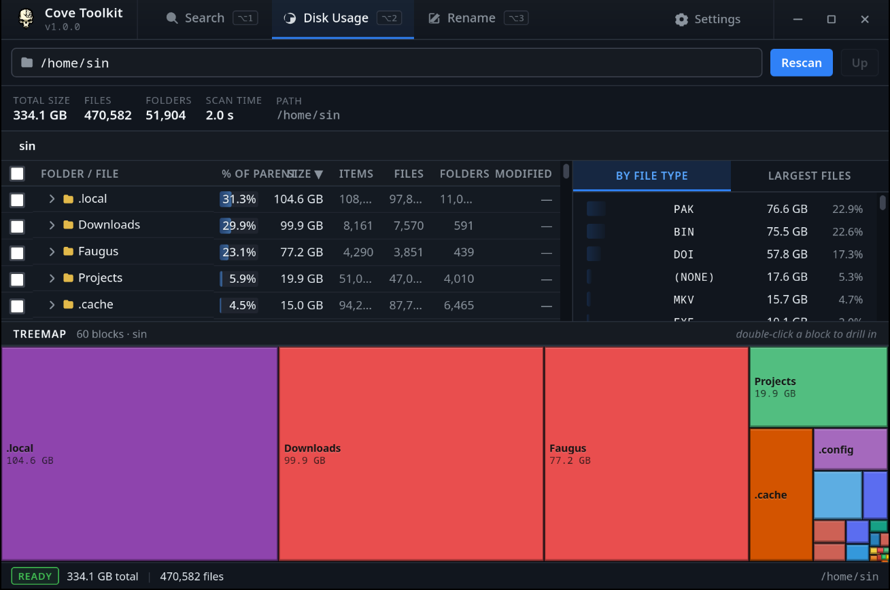
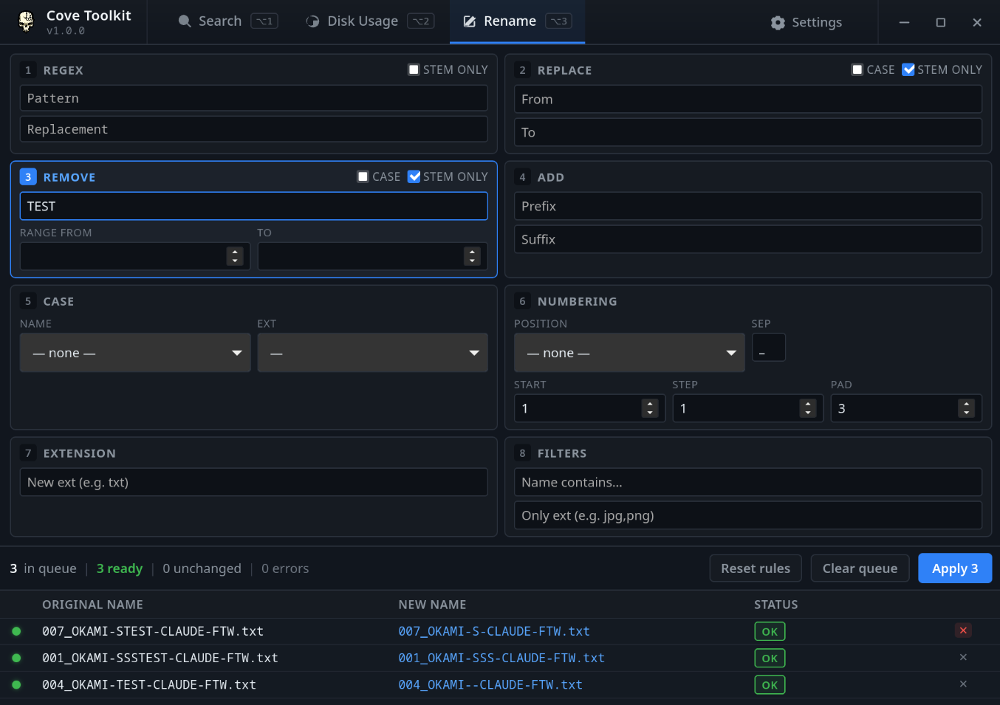

# Cove Toolkit v1.0.0

Dense desktop file utility built with Tauri 2.x, Svelte 5, and Rust. An
all-in-one tool for filename search, disk-usage analysis, and bulk renaming —
inspired by Everything, WizTree, and Bulk Rename Utility, in Cove style.

## Features

### Search (Everything-style)
Multi-root indexed file search with persistent cache, wildcards (`*` `?`),
case-insensitive name+path matching, dense results table, double-click open,
right-click context menu, force rebuild, status bar with live counters.



### Disk Usage (WizTree-style)
Tree-style folder/file table with %-of-parent bars, sortable columns,
expand/collapse, breadcrumbs, side panels for file types and largest files,
summary metrics, and a treemap with drill-in.



### Bulk Rename (BRU-style)
8-cell rule grid (RegEx, Replace, Remove, Add, Case, Numbering, Extension,
Filters), live preview with old → new comparison, conflict/error detection,
apply locked when invalid, undo preserved.



### Settings
Indexed-roots manager, excluded folders, search behavior (case-sensitive,
match path, auto-load cache), cache info and clear.

## Prerequisites

- [Rust](https://rustup.rs/) (stable)
- [Node.js](https://nodejs.org/) >= 18
- Tauri system dependencies:
  - **Linux**: `sudo apt install libwebkit2gtk-4.1-dev build-essential curl wget file libxdo-dev libssl-dev libayatana-appindicator3-dev librsvg2-dev`
  - **Windows**: WebView2 (bundled with Windows 10/11)

## Development

```bash
npm install
npm run tauri dev
```

## Build

```bash
npm run tauri build
```

Build artifacts are placed in `src-tauri/target/release/bundle/`.

### Release artifacts

Each release ships four binaries plus matching `.sha256` sidecars:

| Platform | Artifact | Built by |
|----------|----------|----------|
| Linux | `Cove-File-Toolkit-<ver>-x86_64.AppImage` | Local Linux build (`npm run tauri build`) |
| Linux | `Cove-File-Toolkit-<ver>-amd64.deb` | Local Linux build (`npm run tauri build`) |
| Windows | `Cove-File-Toolkit-<ver>-Setup.exe` | GitHub Actions (`.github/workflows/release.yml` on tag push) |
| Windows | `Cove-File-Toolkit-<ver>-Portable.exe` | Linux cross-build via `cargo-xwin` |

> **Windows notes:** Both Windows artifacts require WebView2 Runtime on the
> target machine (preinstalled on Windows 10/11). Neither is code-signed —
> SmartScreen will prompt on first run.

### Checksums

Every release binary ships with a `.sha256` sidecar generated via
`sha256sum <artifact> > <artifact>.sha256`. Verify after download:

```bash
sha256sum -c Cove-File-Toolkit-<ver>-<artifact>.sha256
```

## Runtime dependencies

- **Linux**: WebKitGTK 4.1 (`libwebkit2gtk-4.1`), GTK 3
- **Windows**: WebView2 (bundled with Windows 10/11)

## Known limitations

- No code signing — Windows SmartScreen / macOS Gatekeeper will warn
- No auto-update integration
- Index cache stores absolute paths — not portable across machines

## Architecture

- **Backend (Rust)**: SoA file index with string-interner, parallel jwalk scanning, paged search with globset, DiskUsage tree with bottom-up accumulation, rename engine with rollback, JSON cache persistence
- **Frontend (Svelte 5)**: Runes-based reactivity, virtual scrolling table, Tauri event listeners for scan progress, debounced search and rename preview
